# System Diagrams

Generated by `yarn docs:system-diagrams`. These diagrams are intentionally higher-level than `yarn graph:project` so they can be used for architectural review.

- Diagrams: 11
- System nodes: 58
- System edges: 50
- Findings: 12
- Audit actions: 18
- Import graph: 871 files, 2488 edges
- Rules version: 33

## Audit Actions

These are the current system gaps or guardrails surfaced by the diagrams.

- **P2 Keep route contracts authoritative** (Navigation Flow, done): When adding any route, overlay, or shell chrome state, add or update a navigation contract plus a focused renderer/store regression. Command: `yarn gate:navigation`.
  Verifies: Route action cannot bypass App shell state or strand the player on a stale screen.
  Evidence: `src/renderer/App.tsx`, `src/renderer/store/useAppStore.ts`, `src/renderer/store/navigationModel.ts`, `docs/new_design/NAVIGATION_MODEL.md`
- **P1 Use a focused action-loop gate for match changes** (Gameplay Resolution, done): Match, break, board-power, and trait changes should run `yarn gate:action-loop` before full-suite handoff. Command: `yarn gate:action-loop`.
  Verifies: A change in one resolver branch cannot silently regress another branch of the same turn loop.
  Evidence: `src/shared/game.ts`, `src/shared/softlock-fairness.test.ts`, `src/shared/board-power-actions.ts`, `src/shared/chunk-break-rules.ts`
- **P0 Keep cross-feature mechanics in the executable graph** (Gameplay Interaction Graph, done): Any new trait, objective, board power, or reward sink must update the gameplay interaction graph and keep its validation test passing. Command: `yarn vitest run src/shared/gameplay-interaction-graph.test.ts`.
  Verifies: Disconnected mechanics, unguarded blockers, missing counterplay, and unwired state outputs fail before they can become softlocks.
  Evidence: `src/shared/gameplay-interaction-graph-data.json`, `src/shared/gameplay-interaction-graph.ts`, `src/shared/gameplay-interaction-graph.test.ts`, `src/shared/softlock-fairness.test.ts`, `src/shared/tile-trait-rules.ts`
- **P0 Extend the softlock matrix for every new blocker** (Board Generation, done): New trait blockers or objectives must add a softlock-fairness or softlock-generator-contract case that proves a completion path exists after generation and repair. Command: `yarn gate:sim-softlock-seeds`.
  Verifies: Generated boards remain completable even when repair has to intervene.
  Evidence: `src/shared/board-generation.ts`, `src/shared/board-build-rules.ts`, `src/shared/softlock-fairness.test.ts`, `src/shared/softlock-generator-contract.ts`, `src/shared/softlock-generator-contract.test.ts`, `src/shared/board-tile-generation-rules.ts`
- **P1 Stress sweep generated seeds after progression changes** (Board Generation, done): Run a broader deterministic seed sweep when touching generation, objectives, or repair rules so rare schedule interactions are exercised before browser QA. Command: `yarn gate:softlock-full`.
  Verifies: Generated stress seeds clear without fairness issues or dead traits.
  Evidence: `src/shared/board-generation.ts`, `src/shared/board-build-rules.ts`, `src/shared/softlock-fairness.test.ts`, `src/shared/softlock-generator-contract.ts`, `src/shared/softlock-generator-contract.test.ts`, `src/shared/board-tile-generation-rules.ts`
- **P1 Name every currency in the run economy taxonomy** (Rewards And Economy, done): Any new source or sink must appear in the run-economy taxonomy with its source and sink and keep the balance simulation bands. Command: `yarn gate:rewards-economy`.
  Verifies: No currency is earned or spent that the taxonomy does not name.
  Evidence: `src/shared/run-economy.ts`, `src/shared/run-economy.test.ts`, `src/shared/findables.ts`, `src/shared/balance-simulation.ts`
- **P1 Keep traits visible as a third mechanic** (Trait Systems, done): New trait interactions should update simulation visibility metrics, first-run HUD smoke, and at least one `yarn gate:action-loop` board-power interaction case. Command: `yarn gate:action-loop`.
  Verifies: Trait routes stay present early and interact with movement/shuffle tools instead of becoming rare flavor.
  Evidence: `src/shared/tile-trait-rules.ts`, `src/shared/tile-trait-rules.test.ts`, `src/shared/board-power-actions.ts`, `src/shared/balance-simulation.ts`, `src/renderer/components/RunShell.tsx`
- **P1 Gate save changes through cross-process tests** (Persistence Save Flow, done): Any save shape, rules version, or write-error change should run persistence tests plus typecheck before handoff. Command: `yarn gate:persistence`.
  Verifies: Save data remains serializable, loadable, and failure-tolerant across renderer and main process boundaries.
  Evidence: `src/main/persistence.ts`, `src/main/persistence.test.ts`, `src/main/persistence-write-error.test.ts`, `src/shared/contracts.ts`, `src/renderer/store/useAppStore.ts`
- **P1 Keep tile input paths behaviorally equivalent** (Renderer Input Flow, done): Any TileBoard or store input change should run renderer input tests that cover DOM accessibility, WebGL fallback, pointer picking, and store dispatch. Command: `yarn gate:renderer-input`.
  Verifies: Players can perform the same legal move through every supported input/rendering path.
  Evidence: `src/renderer/components/TileBoard.tsx`, `src/renderer/components/tileBoardDomAccessibility.ts`, `src/renderer/components/tileBoardPointerPick.ts`, `src/renderer/components/tileBoardWebglBoundary.tsx`, `src/renderer/store/useAppStore.ts`
- **P2 Add feedback coverage for new action outcomes** (Audio Feedback Pipeline, done): When introducing a new visible gameplay outcome, add or update audio interaction coverage and HUD announcement tests. Command: `yarn gate:audio-feedback`.
  Verifies: Important gameplay outcomes have both audible and textual feedback coverage.
  Evidence: `src/renderer/audio/uiSfx.ts`, `src/renderer/audio/audioInteractionCoverage.ts`, `src/renderer/audio/audioInteractionCoverage.test.ts`, `src/renderer/hooks/useHudPoliteLiveAnnouncement.ts`, `src/renderer/components/gameScreenFeedback.ts`, `docs/AUDIO_ASSET_INVENTORY.md`
- **P2 Run rendering gates for asset or card-face edits** (Asset Card Rendering, done): Any card art, manifest, texture, bezel, renderer asset, or board readability change should run the renderer asset audit plus focused card tests before fullcheck. Command: `yarn gate:asset-rendering`.
  Verifies: Card faces remain legible, dropped assets stay referenced, and the asset manifest stays aligned with renderer expectations.
  Evidence: `src/renderer/cardFace/cardIllustrationDraw.ts`, `src/renderer/cardFace/cardIllustrationDraw.test.ts`, `src/renderer/components/tileTextures.ts`, `src/renderer/components/TileBezel.tsx`, `scripts/audit-renderer-assets.mjs`, `scripts/build-card-illustration-manifest.mjs`
- **P0 Keep system actions registered and CI-visible** (Test Gate Architecture, done): New diagrams or audit actions must update the action registry and keep `yarn gate:systems` passing. Command: `yarn gate:systems`.
  Verifies: System diagram docs, audit actions, and CI gate commands remain synchronized.
  Evidence: `package.json`, `scripts/system-diagrams.mjs`, `src/shared/system-diagrams.test.ts`, `docs/agent/GAMEPLAY_RULES_EDIT_MAP.md`, `docs/system-diagrams/AUDIT.md`
- **P0 Keep dependency advisories at zero** (Test Gate Architecture, done): Dependency, lockfile, and audit-tooling changes should run `yarn gate:security` before broader handoff. Command: `yarn gate:security`.
  Verifies: Yarn audit advisories fail fast instead of being hidden by dependency-only audit scopes.
  Evidence: `package.json`, `yarn.lock`, `scripts/audit-summary.mjs`, `scripts/gate-changed.mjs`
- **P1 Keep package hygiene checks green** (Test Gate Architecture, done): Package metadata, Knip config, depcheck config, and package-tooling edits should run `yarn gate:package-hygiene` before broader handoff. Command: `yarn gate:package-hygiene`.
  Verifies: Dependency usage, unused files, production entrypoints, and exported APIs stay intentional as the app surface grows.
  Evidence: `package.json`, `knip.json`, `.depcheckrc.json`, `scripts/check-depcheck-clean.mjs`, `scripts/gate-changed.mjs`
- **P2 Keep renderer bundle output budgeted** (Test Gate Architecture, done): Renderer build, asset, Vite config, and bundle-budget changes should run `yarn gate:build-output` before broader handoff. Command: `yarn gate:build-output`.
  Verifies: Renderer JS chunks, CSS, large assets, and total output size stay inside explicit budgets.
  Evidence: `package.json`, `vite.config.mts`, `scripts/check-renderer-bundle-budget.mjs`, `src/shared/renderer-bundle-budget-script.test.ts`, `scripts/gate-changed.mjs`
- **P1 Keep Electron desktop entrypoints compiling** (Test Gate Architecture, done): Main-process, preload, desktop bridge, package metadata, and tsup config changes should run `yarn gate:desktop-build` before broader handoff. Command: `yarn gate:desktop-build`.
  Verifies: Packaged desktop entrypoints continue to compile independently from renderer-only validation.
  Evidence: `package.json`, `tsup.config.ts`, `src/main/index.ts`, `src/preload/index.ts`, `scripts/gate-changed.mjs`
- **P1 Keep live browser smoke runnable** (Test Gate Architecture, done): Renderer route, asset, WebGL, or Playwright script changes should keep `yarn test:e2e:browser-smoke` green and the slower full smoke shard available. Command: `yarn test:e2e:browser-smoke`.
  Verifies: Demo startup, core navigation, and the bounded 3D board render path work in a real browser instead of only unit/build checks.
  Evidence: `package.json`, `playwright.config.ts`, `e2e/README.md`, `e2e/demo-readiness.spec.ts`, `e2e/playable-path-navigation.spec.ts`, `e2e/board-3d-value.spec.ts`
- **P1 Keep renderer QA shards runnable** (Test Gate Architecture, done): Renderer layout, navigation, interlude, tile face, or WebGL changes should run the matching `yarn test:e2e:renderer-qa:*` shard before broader handoff. Command: `yarn test:e2e:renderer-qa:3d`.
  Verifies: Long renderer QA remains resumable by shard while still covering the full live-browser contract surface.
  Evidence: `package.json`, `playwright.config.ts`, `e2e/README.md`, `e2e/mobile-layout.spec.ts`, `e2e/navigation-flow.spec.ts`, `e2e/playable-path-interludes.spec.ts`, `e2e/tile-card-face-webgl.spec.ts`

## Navigation Flow

Route contracts, shell chrome, and app store actions define how players move between screens.

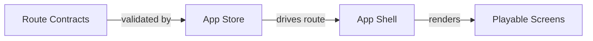

### Findings

- **INFO Navigation has explicit route contracts.** Keep new overlays, route actions, and shell chrome behavior registered in navigationModel so diagram and tests remain aligned.
  Evidence: `src/renderer/App.tsx`, `src/renderer/store/useAppStore.ts`, `src/renderer/store/navigationModel.ts`, `docs/new_design/NAVIGATION_MODEL.md`

### Evidence Nodes

- **Route Contracts** (contract/renderer): Allowed route transitions and action labels. Evidence: `src/renderer/App.tsx`, `src/renderer/store/useAppStore.ts`, `src/renderer/store/navigationModel.ts`, `docs/new_design/NAVIGATION_MODEL.md`
- **App Store** (state/renderer): Central zustand state applies navigation actions. Evidence: `src/renderer/store/useAppStore.ts`
- **App Shell** (ui/renderer): Top-level route rendering and shell chrome. Evidence: `src/renderer/App.tsx`
- **Playable Screens** (ui/renderer): Menu, run map, gameplay, shop, rewards, and meta screens. Evidence: `src/renderer/App.tsx`

## Gameplay Resolution

Card flips resolve through matching, the chunk break, traits, board powers, scoring, and run progression.

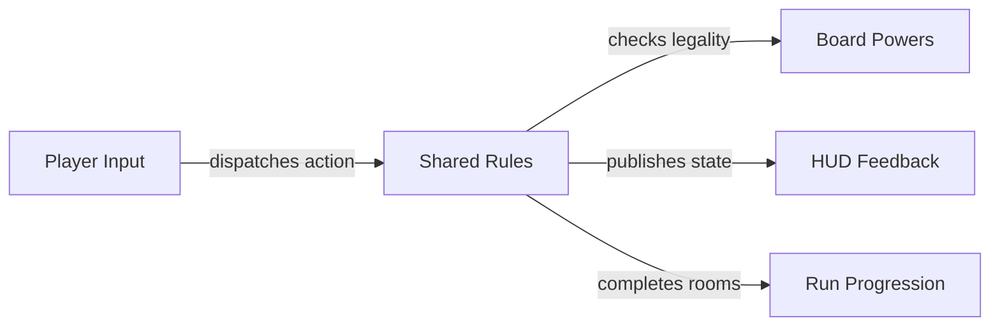

### Findings

- **WARNING Gameplay resolution has a wide blast radius.** Changes to match resolution should keep focused tests around softlocks, powers, the break, traits, HUD copy, and progression because these systems share the same action loop.
  Evidence: `src/shared/game.ts`, `src/shared/softlock-fairness.test.ts`, `src/shared/board-power-actions.ts`, `src/shared/chunk-break-rules.ts`

### Evidence Nodes

- **Player Input** (interaction/renderer): Flip, inspect, match, shuffle, swap, and consume powers. Evidence: `src/renderer/App.tsx`, `src/renderer/components`
- **Shared Rules** (domain/shared): Pure rules resolve matches, the break, traits, and resources. Evidence: `src/shared/game.ts`, `src/shared/tile-trait-rules.ts`
- **Board Powers** (domain/shared): Peek, shuffle, region shuffle, and swap modify board state under legality rules. Evidence: `src/shared/board-power-actions.ts`, `src/shared/board-power-availability.ts`
- **HUD Feedback** (ui/renderer): Gameplay HUD exposes route, trait, resource, and action state. Evidence: `src/renderer/components/RunShell.tsx`
- **Run Progression** (domain/shared): A cleared floor goes straight to the next one. Evidence: `src/shared/floor-clear-transition.ts`, `src/shared/next-floor-transition-rules.ts`

## Gameplay Interaction Graph

Executable registry covers 61 mechanics, 174 edges, 9 tile traits, and 9 blockers.

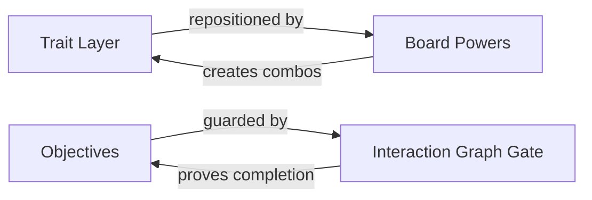

### Findings

- **INFO Cross-feature logic now has an executable graph.** Mechanics declare reads, writes, blockers, counterplay, softlock guards, evidence, and tests. Keep this registry current whenever adding traits, objectives, powers, or break logic.
  Evidence: `src/shared/gameplay-interaction-graph-data.json`, `src/shared/gameplay-interaction-graph.ts`, `src/shared/gameplay-interaction-graph.test.ts`, `src/shared/softlock-fairness.test.ts`, `src/shared/tile-trait-rules.ts`
- **WARNING Every blocker needs counterplay or a softlock guard.** The graph currently tracks 9 blocking mechanics. New blockers should fail validation unless they declare counterplay edges, tests, and softlock guards.
  Evidence: `src/shared/gameplay-interaction-graph-data.json`, `src/shared/gameplay-interaction-graph.ts`, `src/shared/gameplay-interaction-graph.test.ts`, `src/shared/softlock-fairness.test.ts`, `src/shared/tile-trait-rules.ts`

### Evidence Nodes

- **Trait Layer** (domain/shared): 9 trait mechanics with synergy, risk, and counterplay edges. Evidence: `src/shared/tile-trait-rules.ts`, `src/shared/trait-opportunities.ts`
- **Board Powers** (domain/shared): 11 routing/removal tools connect player agency to trait layouts. Evidence: `src/shared/board-power-actions.ts`, `src/shared/board-power-availability.ts`
- **Objectives** (domain/shared): Objectives must connect to the floor clear. Evidence: `src/shared/level-clear-rules.ts`
- **Interaction Graph Gate** (safety/shared): Typed graph validation fails disconnected mechanics, unguarded blockers, and unwired outputs. Evidence: `src/shared/gameplay-interaction-graph-data.json`, `src/shared/gameplay-interaction-graph.ts`, `src/shared/gameplay-interaction-graph.test.ts`, `src/shared/softlock-fairness.test.ts`, `src/shared/tile-trait-rules.ts`

## Board Generation

Floor identity, objectives, tile pools, trait overlays, and repair rules build playable boards.

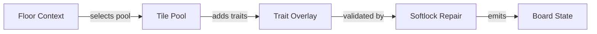

### Findings

- **WARNING Softlock repair is part of the generation contract.** Treat repair as required generation behavior, not a cleanup detail. New blockers, objectives, or trait blockers need property tests that prove at least one completion route remains.
  Evidence: `src/shared/board-generation.ts`, `src/shared/board-build-rules.ts`, `src/shared/softlock-fairness.test.ts`, `src/shared/softlock-generator-contract.ts`, `src/shared/softlock-generator-contract.test.ts`, `src/shared/board-tile-generation-rules.ts`

### Evidence Nodes

- **Floor Context** (domain/shared): Floor, objective, mutator, and seed inputs. Evidence: `src/shared/floor-mutator-schedule.ts`, `src/shared/contracts.ts`
- **Tile Pool** (domain/shared): Base pairs, suits, findables, and supports. Evidence: `src/shared/board-tile-generation-rules.ts`
- **Trait Overlay** (domain/shared): Trait-aware generation places comboable and reactive tile traits. Evidence: `src/shared/tile-trait-rules.ts`
- **Softlock Repair** (safety/shared): Post-generation pass repairs completion routes. Evidence: `src/shared/board-generation.ts`, `src/shared/board-build-rules.ts`, `src/shared/softlock-fairness.test.ts`, `src/shared/softlock-generator-contract.ts`, `src/shared/softlock-generator-contract.test.ts`, `src/shared/board-tile-generation-rules.ts`
- **Board State** (state/shared): Serializable board consumed by renderer and resolution rules. Evidence: `src/shared/contracts.ts`, `src/shared/board-generation.ts`

## Rewards And Economy

Shards, guard tokens and findable pickups are what a run earns. Gold and the shop went in Gen 174, the relics and bonus rewards in Gen 175 and 176; nothing is bought or drafted.

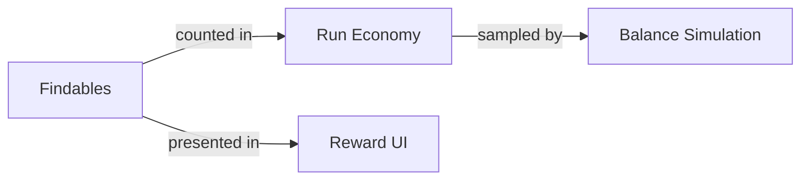

### Findings

- **INFO The run economy is three counters.** Shards, guard tokens and charges are all a run earns now. A new source or sink must be named in the run-economy taxonomy and sampled by the balance simulation.
  Evidence: `src/shared/run-economy.ts`, `src/shared/run-economy.test.ts`, `src/shared/findables.ts`, `src/shared/balance-simulation.ts`

### Evidence Nodes

- **Findables** (domain/shared): Findable pairs pay score, shards or a ward when matched. Evidence: `src/shared/findables.ts`
- **Run Economy** (state/shared): The run economy taxonomy names every temporary currency, its source and its sink. Evidence: `src/shared/run-economy.ts`
- **Balance Simulation** (analysis/shared): Simulation watches pressure, cascade and trait floor share. Evidence: `src/shared/balance-simulation.ts`
- **Reward UI** (ui/renderer): The floor-clear dialog and the inventory show what the run holds. Evidence: `src/renderer/components`, `src/renderer/App.tsx`

## Trait Systems

Traits are a third gameplay layer: placement, matching, blockers, interactions, rewards, powers, and HUD visibility.

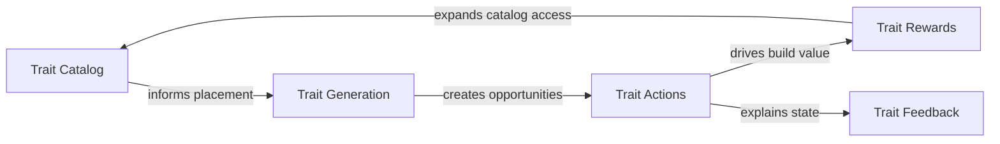

### Findings

- **INFO Traits are now core-loop material.** Keep trait opportunities visible from early floors and track trait-match-route floor share in simulation whenever adding new interactions or blockers.
  Evidence: `src/shared/tile-trait-rules.ts`, `src/shared/tile-trait-rules.test.ts`, `src/shared/board-power-actions.ts`, `src/shared/balance-simulation.ts`, `src/renderer/components/RunShell.tsx`

### Evidence Nodes

- **Trait Catalog** (domain/shared): Trait definitions, combos, blockers, and interaction hooks. Evidence: `src/shared/tile-trait-rules.ts`
- **Trait Generation** (domain/shared): Board generation seeds route-visible trait opportunities. Evidence: `src/shared/board-generation.ts`, `src/shared/board-tile-generation-rules.ts`
- **Trait Actions** (domain/shared): Matches and board powers create, move, reveal, or block trait opportunities. Evidence: `src/shared/board-power-actions.ts`, `src/shared/game.ts`
- **Trait Rewards** (economy/shared): Trait objectives pay score toward the floor. Evidence: `src/shared/trait-route-objectives.ts`
- **Trait Feedback** (ui/renderer): HUD and tile faces make combo routes readable immediately. Evidence: `src/renderer/components/RunShell.tsx`, `src/renderer/cardFace`

## Persistence Save Flow

Main-process persistence, preload contracts, and renderer state decide how runs and settings survive app restarts.

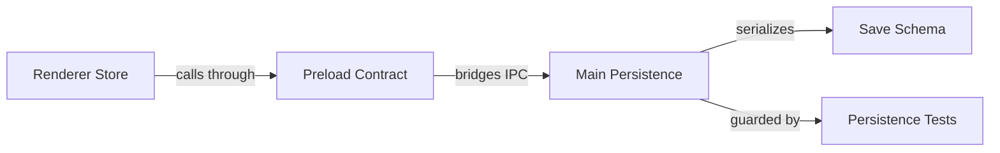

### Findings

- **WARNING Save changes cross process boundaries.** Persistence changes need contract, main-process, and renderer-state checks together because a green domain test can still miss an IPC or serialization drift.
  Evidence: `src/main/persistence.ts`, `src/main/persistence.test.ts`, `src/main/persistence-write-error.test.ts`, `src/shared/contracts.ts`, `src/renderer/store/useAppStore.ts`

### Evidence Nodes

- **Renderer Store** (state/renderer): Runtime state requests save, load, reset, and migration behavior. Evidence: `src/renderer/store/useAppStore.ts`
- **Preload Contract** (contract/renderer): Typed IPC boundary exposes persistence calls to renderer code. Evidence: `src/preload`, `src/shared/contracts.ts`
- **Main Persistence** (service/main): Disk-backed store reads, writes, and reports persistence errors. Evidence: `src/main/persistence.ts`
- **Save Schema** (contract/shared): Shared contracts define serializable save fields and rules version. Evidence: `src/shared/contracts.ts`
- **Persistence Tests** (gate/main): Regression tests cover normal writes and write-error handling. Evidence: `src/main/persistence.ts`, `src/main/persistence.test.ts`, `src/main/persistence-write-error.test.ts`, `src/shared/contracts.ts`, `src/renderer/store/useAppStore.ts`

## Renderer Input Flow

DOM accessibility, pointer picking, WebGL boundaries, and store actions translate player intent into legal game actions.

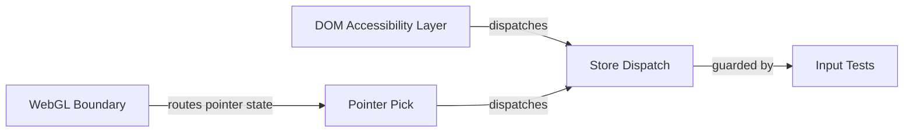

### Findings

- **WARNING Input has multiple equivalent entry points.** Tile interaction changes should prove DOM fallback, keyboard, pointer, WebGL boundary, and store dispatch still agree on the same legal action.
  Evidence: `src/renderer/components/TileBoard.tsx`, `src/renderer/components/tileBoardDomAccessibility.ts`, `src/renderer/components/tileBoardPointerPick.ts`, `src/renderer/components/tileBoardWebglBoundary.tsx`, `src/renderer/store/useAppStore.ts`

### Evidence Nodes

- **DOM Accessibility Layer** (interaction/renderer): Keyboard, labels, and fallback surface expose playable tile actions. Evidence: `src/renderer/components/tileBoardDomAccessibility.ts`
- **Pointer Pick** (interaction/renderer): Pointer and raycast helpers identify the intended tile or board target. Evidence: `src/renderer/components/tileBoardPointerPick.ts`, `src/renderer/components/tileBoardPick.ts`
- **WebGL Boundary** (render/renderer): Renderer chooses WebGL or DOM fallback without changing legal action semantics. Evidence: `src/renderer/components/tileBoardWebglBoundary.tsx`
- **Store Dispatch** (state/renderer): useAppStore applies input actions to the shared game state. Evidence: `src/renderer/store/useAppStore.ts`
- **Input Tests** (gate/renderer): Focused tests keep DOM, pointer, WebGL, and store paths equivalent. Evidence: `src/renderer/components/TileBoard.tsx`, `src/renderer/components/tileBoardDomAccessibility.ts`, `src/renderer/components/tileBoardPointerPick.ts`, `src/renderer/components/tileBoardWebglBoundary.tsx`, `src/renderer/store/useAppStore.ts`

## Audio Feedback Pipeline

Gameplay events become audio cues, HUD announcements, and visible feedback so core actions are legible.

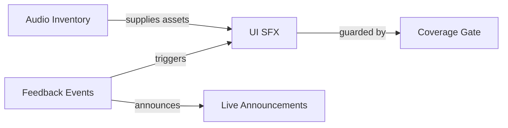

### Findings

- **INFO Feedback coverage should move with gameplay systems.** New actions, rewards, and blockers should include audio and announcement coverage so mechanics stay readable without relying only on visuals.
  Evidence: `src/renderer/audio/uiSfx.ts`, `src/renderer/audio/audioInteractionCoverage.ts`, `src/renderer/audio/audioInteractionCoverage.test.ts`, `src/renderer/hooks/useHudPoliteLiveAnnouncement.ts`, `src/renderer/components/gameScreenFeedback.ts`, `docs/AUDIO_ASSET_INVENTORY.md`

### Evidence Nodes

- **Feedback Events** (domain/renderer): Game screen feedback maps action results into player-facing cues. Evidence: `src/renderer/components/gameScreenFeedback.ts`
- **UI SFX** (service/renderer): Audio service triggers short cues for interactions and state changes. Evidence: `src/renderer/audio/uiSfx.ts`
- **Live Announcements** (accessibility/renderer): HUD polite live regions mirror important state changes in text. Evidence: `src/renderer/hooks/useHudPoliteLiveAnnouncement.ts`
- **Audio Inventory** (asset/docs): Inventory documents available and placeholder audio coverage. Evidence: `docs/AUDIO_ASSET_INVENTORY.md`
- **Coverage Gate** (gate/renderer): Coverage tests prove important interactions have cue coverage. Evidence: `src/renderer/audio/uiSfx.ts`, `src/renderer/audio/audioInteractionCoverage.ts`, `src/renderer/audio/audioInteractionCoverage.test.ts`, `src/renderer/hooks/useHudPoliteLiveAnnouncement.ts`, `src/renderer/components/gameScreenFeedback.ts`, `docs/AUDIO_ASSET_INVENTORY.md`

## Asset Card Rendering

Card-face illustrations, generated manifests, texture assets, bezels, asset audits, and board readability tests define the card presentation pipeline.

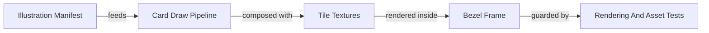

### Findings

- **WARNING Card rendering is an asset and code contract.** Asset pipeline changes should run the renderer asset audit plus illustration and readability tests because generated manifests and dropped files can drift independently from TypeScript render code.
  Evidence: `src/renderer/cardFace/cardIllustrationDraw.ts`, `src/renderer/cardFace/cardIllustrationDraw.test.ts`, `src/renderer/components/tileTextures.ts`, `src/renderer/components/TileBezel.tsx`, `scripts/audit-renderer-assets.mjs`, `scripts/build-card-illustration-manifest.mjs`

### Evidence Nodes

- **Illustration Manifest** (asset/scripts): Build script emits available card-face illustration metadata. Evidence: `scripts/build-card-illustration-manifest.mjs`
- **Card Draw Pipeline** (render/renderer): Card-face drawing turns tile identity into readable illustrations. Evidence: `src/renderer/cardFace/cardIllustrationDraw.ts`
- **Tile Textures** (render/renderer): Texture helpers and revisions feed the board rendering layers. Evidence: `src/renderer/components/tileTextures.ts`, `src/renderer/components/tileBoardTextureRevision.ts`
- **Bezel Frame** (render/renderer): Tile bezel/frame components provide readable framing and state accents. Evidence: `src/renderer/components/TileBezel.tsx`, `src/renderer/components/tileBoardFrameVisualState.ts`
- **Rendering And Asset Tests** (gate/renderer): Asset audits, illustration tests, and readability tests catch card-face regressions. Evidence: `src/renderer/cardFace/cardIllustrationDraw.ts`, `src/renderer/cardFace/cardIllustrationDraw.test.ts`, `src/renderer/components/tileTextures.ts`, `src/renderer/components/TileBezel.tsx`, `scripts/audit-renderer-assets.mjs`, `scripts/build-card-illustration-manifest.mjs`

## Test Gate Architecture

Package scripts, system diagrams, package hygiene, security audit tooling, renderer build budgets, desktop build checks, browser smoke, edit maps, and focused tests define which gates should run for each system change.

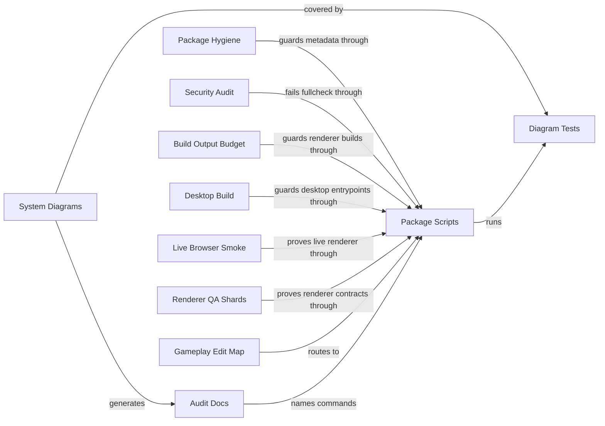

### Findings

- **INFO System gates need a checked action register.** Action status and commands should stay in one validated registry so docs, UI, and CI fail together when an audit action drifts.
  Evidence: `package.json`, `scripts/system-diagrams.mjs`, `src/shared/system-diagrams.test.ts`, `docs/agent/GAMEPLAY_RULES_EDIT_MAP.md`, `docs/system-diagrams/AUDIT.md`

### Evidence Nodes

- **Package Scripts** (gate/root): Yarn scripts compose lint, typecheck, focused gates, fullcheck, and CI. Evidence: `package.json`
- **Package Hygiene** (gate/scripts): Depcheck and Knip keep dependency metadata, unused files, production entrypoints, and exported APIs intentional. Evidence: `package.json`, `knip.json`, `.depcheckrc.json`, `scripts/check-depcheck-clean.mjs`, `scripts/gate-changed.mjs`
- **Security Audit** (gate/scripts): Dependency advisories are summarized and fail the security gate before fullcheck continues. Evidence: `package.json`, `yarn.lock`, `scripts/audit-summary.mjs`, `scripts/gate-changed.mjs`
- **Build Output Budget** (gate/scripts): Renderer builds run against explicit JS, CSS, asset, and total output budgets. Evidence: `package.json`, `vite.config.mts`, `scripts/check-renderer-bundle-budget.mjs`, `src/shared/renderer-bundle-budget-script.test.ts`, `scripts/gate-changed.mjs`
- **Desktop Build** (gate/scripts): Electron main and preload bundles compile through tsup for packaged desktop entrypoints. Evidence: `package.json`, `tsup.config.ts`, `src/main/index.ts`, `src/preload/index.ts`, `scripts/gate-changed.mjs`
- **Live Browser Smoke** (gate/e2e): Playwright smoke proves demo startup, core navigation, and nonblank 3D board rendering in a real browser. Evidence: `package.json`, `playwright.config.ts`, `e2e/README.md`, `e2e/demo-readiness.spec.ts`, `e2e/playable-path-navigation.spec.ts`, `e2e/board-3d-value.spec.ts`
- **Renderer QA Shards** (gate/e2e): Split Playwright shards cover layout, navigation, interludes, and 3D/WebGL paths without one oversized runner. Evidence: `package.json`, `playwright.config.ts`, `e2e/README.md`, `e2e/mobile-layout.spec.ts`, `e2e/navigation-flow.spec.ts`, `e2e/playable-path-interludes.spec.ts`, `e2e/tile-card-face-webgl.spec.ts`
- **System Diagrams** (analysis/scripts): Diagram generator maps system surfaces, evidence, findings, and audit actions. Evidence: `scripts/system-diagrams.mjs`
- **Diagram Tests** (gate/shared): Tests assert diagram payload shape, evidence links, and markdown output. Evidence: `src/shared/system-diagrams.test.ts`
- **Gameplay Edit Map** (docs/docs): Agent-facing map routes gameplay edits to matching rules and tests. Evidence: `docs/agent/GAMEPLAY_RULES_EDIT_MAP.md`
- **Audit Docs** (docs/docs): Generated audit report exposes action status, commands, and evidence. Evidence: `docs/system-diagrams/AUDIT.md`
