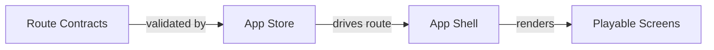
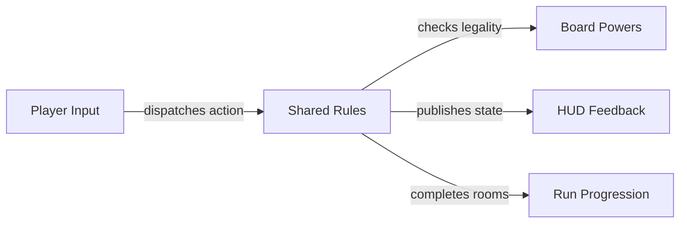
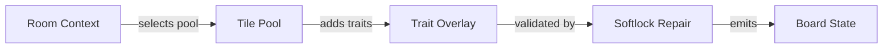
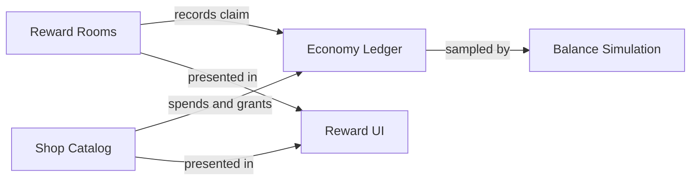
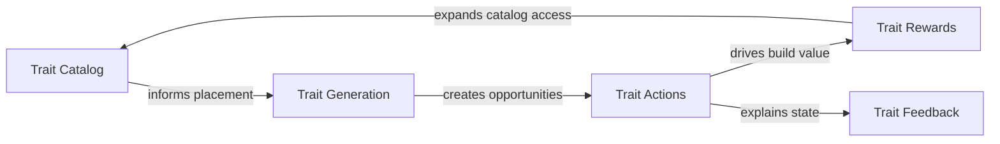

# System Diagrams

Generated by `yarn docs:system-diagrams`. These diagrams are intentionally higher-level than `yarn graph:project` so they can be used for architectural review.

- Diagrams: 5
- System nodes: 24
- System edges: 21
- Findings: 5
- Audit actions: 5
- Import graph: 743 files, 2211 edges
- Rules version: 32

## Audit Actions

These are the current system gaps or guardrails surfaced by the diagrams.

- **P2 Keep route contracts authoritative** (Navigation Flow): When adding any route, overlay, or shell chrome state, add or update a navigation contract plus a focused renderer/store regression.
  Verifies: Route action cannot bypass App shell state or strand the player on a stale screen.
  Evidence: `src/renderer/App.tsx`, `src/renderer/store/useAppStore.ts`, `src/renderer/store/navigationModel.ts`, `docs/new_design/NAVIGATION_MODEL.md`
- **P1 Use a focused action-loop gate for match changes** (Gameplay Resolution): Match, enemy, hazard, board-power, and trait changes should run the shared gameplay slice before full-suite handoff.
  Verifies: A change in one resolver branch cannot silently regress another branch of the same turn loop.
  Evidence: `src/shared/game.ts`, `src/shared/softlock-fairness.test.ts`, `src/shared/board-power-actions.ts`, `src/shared/hazard-tiles.ts`
- **P0 Extend the softlock matrix for every new blocker** (Board Generation): New locks, trait blockers, enemies, objectives, or exit states must add a softlock-fairness or softlock-generator-contract case that proves a completion path exists after generation and repair.
  Verifies: Generated boards remain completable even when repair has to intervene.
  Evidence: `src/shared/board-generation.ts`, `src/shared/board-build-rules.ts`, `src/shared/softlock-fairness.test.ts`, `src/shared/softlock-generator-contract.ts`, `src/shared/softlock-generator-contract.test.ts`, `src/shared/board-tile-generation-rules.ts`, `src/shared/objective-rules.ts`
- **P1 Lock reward priority slots before adding fun offers** (Rewards And Economy): Any new shop or reward offer must prove it does not displace required keys, boss access, loadout recovery, or trait-route starter support.
  Verifies: Progression-critical offers remain reachable while optional trait tools still appear.
  Evidence: `src/shared/bonus-rewards.ts`, `src/shared/shop-rules.ts`, `src/shared/relics.ts`, `src/shared/economy-ledger.ts`, `src/shared/balance-simulation.ts`
- **P1 Keep traits visible as a third mechanic** (Trait Systems): New trait interactions should update simulation visibility metrics, first-run HUD smoke, and at least one board-power interaction case.
  Verifies: Trait routes stay present early and interact with movement/shuffle tools instead of becoming rare flavor.
  Evidence: `src/shared/tile-trait-rules.ts`, `src/shared/tile-trait-rules.test.ts`, `src/shared/board-power-actions.ts`, `src/shared/balance-simulation.ts`, `src/renderer/components/GameplayHudBar.tsx`

## Navigation Flow

Route contracts, shell chrome, and app store actions define how players move between screens.

### Findings

- **INFO Navigation has explicit route contracts.** Keep new overlays, route actions, and shell chrome behavior registered in navigationModel so diagram and tests remain aligned.
  Evidence: `src/renderer/App.tsx`, `src/renderer/store/useAppStore.ts`, `src/renderer/store/navigationModel.ts`, `docs/new_design/NAVIGATION_MODEL.md`

### Evidence Nodes

- **Route Contracts** (contract/renderer): Allowed route transitions and action labels. Evidence: `src/renderer/App.tsx`, `src/renderer/store/useAppStore.ts`, `src/renderer/store/navigationModel.ts`, `docs/new_design/NAVIGATION_MODEL.md`
- **App Store** (state/renderer): Central zustand state applies navigation actions. Evidence: `src/renderer/store/useAppStore.ts`
- **App Shell** (ui/renderer): Top-level route rendering and shell chrome. Evidence: `src/renderer/App.tsx`
- **Playable Screens** (ui/renderer): Menu, run map, gameplay, shop, rewards, and meta screens. Evidence: `src/renderer/App.tsx`

## Gameplay Resolution

Card flips resolve through matching, traits, hazards, enemies, board powers, scoring, and run progression.

### Findings

- **WARNING Gameplay resolution has a wide blast radius.** Changes to match resolution should keep focused tests around softlocks, powers, enemies, traits, HUD route copy, and progression because these systems share the same action loop.
  Evidence: `src/shared/game.ts`, `src/shared/softlock-fairness.test.ts`, `src/shared/board-power-actions.ts`, `src/shared/hazard-tiles.ts`

### Evidence Nodes

- **Player Input** (interaction/renderer): Flip, inspect, match, shuffle, swap, and consume powers. Evidence: `src/renderer/App.tsx`, `src/renderer/components`
- **Shared Rules** (domain/shared): Pure rules resolve matches, hazards, traits, enemies, and resources. Evidence: `src/shared/game.ts`, `src/shared/tile-trait-rules.ts`
- **Board Powers** (domain/shared): Peek, shuffle, region shuffle, and swap modify board state under legality rules. Evidence: `src/shared/board-power-actions.ts`, `src/shared/board-power-availability.ts`
- **HUD Feedback** (ui/renderer): Gameplay HUD exposes route, trait, resource, and action state. Evidence: `src/renderer/components/GameplayHudBar.tsx`
- **Run Progression** (domain/shared): Room completion advances route, rewards, shops, elites, and bosses. Evidence: `src/shared/run-map.ts`, `src/shared/bonus-rewards.ts`

## Board Generation

Room identity, objectives, tile pools, trait overlays, and repair rules build playable boards.

### Findings

- **WARNING Softlock repair is part of the generation contract.** Treat repair as required generation behavior, not a cleanup detail. New locks, blockers, objectives, or trait blockers need property tests that prove at least one completion route remains.
  Evidence: `src/shared/board-generation.ts`, `src/shared/board-build-rules.ts`, `src/shared/softlock-fairness.test.ts`, `src/shared/softlock-generator-contract.ts`, `src/shared/softlock-generator-contract.test.ts`, `src/shared/board-tile-generation-rules.ts`, `src/shared/objective-rules.ts`

### Evidence Nodes

- **Room Context** (domain/shared): Floor, route, lock, objective, mutator, and seed inputs. Evidence: `src/shared/run-map.ts`, `src/shared/contracts.ts`
- **Tile Pool** (domain/shared): Base pairs, enemies, hazards, findables, locks, and supports. Evidence: `src/shared/board-tile-generation-rules.ts`
- **Trait Overlay** (domain/shared): Trait-aware generation places comboable and reactive tile traits. Evidence: `src/shared/tile-trait-rules.ts`
- **Softlock Repair** (safety/shared): Post-generation pass repairs missing keys, exits, and completion routes. Evidence: `src/shared/board-generation.ts`, `src/shared/board-build-rules.ts`, `src/shared/softlock-fairness.test.ts`, `src/shared/softlock-generator-contract.ts`, `src/shared/softlock-generator-contract.test.ts`, `src/shared/board-tile-generation-rules.ts`, `src/shared/objective-rules.ts`
- **Board State** (state/shared): Serializable board consumed by renderer and resolution rules. Evidence: `src/shared/contracts.ts`, `src/shared/board-generation.ts`

## Rewards And Economy

Rewards, shops, relics, gold, shards, and route priorities decide what the player can buy or draft.

### Findings

- **WARNING Reward priority overlaps need regression coverage.** Key, boss, loadout, trait-routing, and shop-service offers compete for limited slots. Keep tests around priority ordering so fun trait tools do not hide required progression items.
  Evidence: `src/shared/bonus-rewards.ts`, `src/shared/shop-rules.ts`, `src/shared/relics.ts`, `src/shared/economy-ledger.ts`, `src/shared/balance-simulation.ts`

### Evidence Nodes

- **Reward Rooms** (domain/shared): Bonus reward rooms grant gold, traits, relics, or board tools. Evidence: `src/shared/bonus-rewards.ts`
- **Shop Catalog** (domain/shared): Shop services and items route scarce keys, powers, relics, and trait tools. Evidence: `src/shared/shop-rules.ts`
- **Economy Ledger** (state/shared): Ledger records inflows, sinks, caps, and reward claims. Evidence: `src/shared/economy-ledger.ts`
- **Balance Simulation** (analysis/shared): Simulation watches access, spend, route pressure, and trait floor share. Evidence: `src/shared/balance-simulation.ts`
- **Reward UI** (ui/renderer): Renderer shows pickable rewards and shop decisions. Evidence: `src/renderer/components`, `src/renderer/App.tsx`

## Trait Systems

Traits are a third gameplay layer: placement, matching, blockers, interactions, rewards, powers, and HUD visibility.

### Findings

- **INFO Traits are now core-loop material.** Keep trait opportunities visible from early floors and track trait-match-route floor share in simulation whenever adding new interactions or blockers.
  Evidence: `src/shared/tile-trait-rules.ts`, `src/shared/tile-trait-rules.test.ts`, `src/shared/board-power-actions.ts`, `src/shared/balance-simulation.ts`, `src/renderer/components/GameplayHudBar.tsx`

### Evidence Nodes

- **Trait Catalog** (domain/shared): Trait definitions, combos, blockers, and interaction hooks. Evidence: `src/shared/tile-trait-rules.ts`
- **Trait Generation** (domain/shared): Board generation seeds route-visible trait opportunities. Evidence: `src/shared/board-generation.ts`, `src/shared/board-tile-generation-rules.ts`
- **Trait Actions** (domain/shared): Matches and board powers create, move, reveal, or block trait opportunities. Evidence: `src/shared/board-power-actions.ts`, `src/shared/game.ts`
- **Trait Rewards** (economy/shared): Rewards and shops let players build toward trait routes. Evidence: `src/shared/bonus-rewards.ts`, `src/shared/shop-rules.ts`
- **Trait Feedback** (ui/renderer): HUD and tile faces make combo routes readable immediately. Evidence: `src/renderer/components/GameplayHudBar.tsx`, `src/renderer/cardFace`
